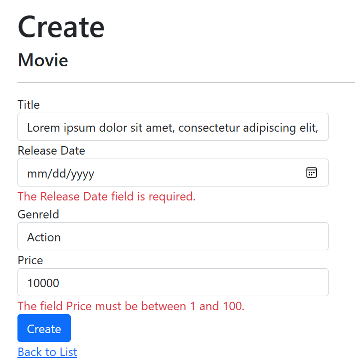

# Tag Helpers and Frontend

In this lab, we'll learn more about how Tag Helpers work and how to use them in our views. We'll also look at how frontend resources are included and how to use Bootstrap to style our views.

## Razor Syntax

Our Razor Pages views are written in a language called Razor. Razor is a templating language that allows us to integrate CE# code into our HTML. There is a [syntax reference](https://learn.microsoft.com/aspnet/core/mvc/views/razor) available, but it's designed to be pretty intuitive and unobtrusive.

A few key things to know if you're new to it:
- By default, everything is HTML
- `@` is used to denote a Razor expression
- `@{` and `}` are used to denote a Razor block

You can see how the expression and block syntax are used in the following example:

```razor
@{
    var joe = new Person("Joe", 33);
}

<p>Age@(joe.Age)</p>
```

## Tag Helpers

While Razor does let us integrate C# logic into our views, it can sometimes get a little verbose. Tag Helpers simplify that by allowing us extend the HTML elements we use in our views. 

There are a few different ways you'll see them:
- Most commonly you'll see them as additional attributes on HTML elements that add functionality like binding or validation
- There are some helpful [built-in utility Tag Helpers](https://learn.microsoft.com/aspnet/core/mvc/views/tag-helpers/intro#built-in-aspnet-cores) that do useful things like generate links, integrate partial views, cache a portion of the page, conditionally include or exclude content based on the environment (development, production, etc.), and more.
- You can create your own Tag Helpers
- There are useful Tag Helpers available in NuGet packages that you can add to your project

### Tag Helpers in Forms

Let's take a look at the Tag Helpers in some of the forms in our application. Here's the form code in `Pages\Admin\Movies\Edit.cshtml`:

```html
<form method="post">
    <div asp-validation-summary="ModelOnly" class="text-danger"></div>
    <input type="hidden" asp-for="Movie.ID" />
    <div class="form-group">
        <label asp-for="Movie.Title" class="control-label"></label>
        <input asp-for="Movie.Title" class="form-control" />
        <span asp-validation-for="Movie.Title" class="text-danger"></span>
    </div>
    <div class="form-group">
        <label asp-for="Movie.ReleaseDate" class="control-label"></label>
        <input asp-for="Movie.ReleaseDate" class="form-control" />
        <span asp-validation-for="Movie.ReleaseDate" class="text-danger"></span>
    </div>
    <div class="form-group">
        <label asp-for="Movie.GenreId" class="control-label"></label>
        <select asp-for="Movie.GenreId" class="form-control" asp-items="ViewBag.GenreId"></select>
        <span asp-validation-for="Movie.GenreId" class="text-danger"></span>
    </div>
    <div class="form-group">
        <label asp-for="Movie.Price" class="control-label"></label>
        <input asp-for="Movie.Price" class="form-control" />
        <span asp-validation-for="Movie.Price" class="text-danger"></span>
    </div>
    <div class="form-group">
        <input type="submit" value="Save" class="btn btn-primary" />
    </div>
</form>
```

You'll notice every tag in that block is a standard HTML tag, but there are a few additional attributes that start with `asp-`. These are Tag Helpers that are built into ASP.NET Core. You'll see the label and input tags are bound to model properties using the `asp-for` attribute. That's how things are wired together: properties are exposed in the **PageModel**, and the **View** uses the `asp-for` attribute to bind to those properties.

Validation is also handled using Tag Helpers. The `asp-validation-summary` attribute on the `div` tag is used to display validation errors. The `asp-validation-for` attribute on the `span` tags is used to display validation errors for a specific property. What's nice is that this validataion is handled automatically, and updates to the model will automatically be picked up by the validation without any additional changes.

### Updating our Movie model to see Tag Helpers in action

Since we've seen that Tag Helpers are use to bind to form labels and validation, let's update our *Movie* model to test it out.

1. Open the `Movie.cs` file in the *AmazingMovies.Models* project.
1. Update the class to appear as follows:
    
    ```csharp
    using System.ComponentModel.DataAnnotations.Schema;
    using System.ComponentModel.DataAnnotations;

    namespace AmazingMovies.Models
    {
        public class Movie
        {
            public int ID { get; set; }

            [StringLength(100)]
            public string Title { get; set; } = string.Empty;

            [Display(Name = "Release Date")]
            [DataType(DataType.Date)]
            public DateTime ReleaseDate { get; set; }
            public Genre? Genre { get; set; } = null;
            public int GenreId { get; set; }

            [Range(1, 100), DataType(DataType.Currency)]
            [Column(TypeName = "decimal(18, 2)")]
            public decimal Price { get; set; }
        }
    }
    ```

    > This adds a new StringLength attribute to the Title property, and new Range and DataType attributes to the Price property.

1. Create and run a new migration to update the database:
    
    ```powershell
    cd .\RazorPagesMovie\
    dotnet ef migrations add "Add movie annotations"
    dotnet ef database update
    ```

1. Run the application and navigate to the **Edit** page for a movie.
1. Try to enter a movie that breaks the validation rules. The browser will prevent you from entering more than 100 characters for the title, and will prevent you from entering a price that is less than 1 or greater than 100.



## Updating Navigation in the Layout

If you haven't yet, you should update the navigation in the layout to include links to the **Movies** and **Genres** pages. You can do that by updating the `ul` in `Pages/Shared/_Layout.cshtml` to appear as follows:

```html
<ul class="navbar-nav flex-grow-1">
    <li class="nav-item">
        <a class="nav-link text-dark" asp-area="" asp-page="/Index">Home</a>
    </li>
    <li class="nav-item">
        <a class="nav-link text-dark" asp-area="" asp-page="/Admin/Movies/Index">Movies</a>
    </li>
    <li class="nav-item">
        <a class="nav-link text-dark" asp-area="" asp-page="/Admin/Genres/Index">Genres</a>
    </li>
</ul>
```

Now when you run the application you will see links to the **Movies** and **Genres** pages in the navigation.

## Add News to the home page

## Convert the news section to use a partial view

## Add a Bootstrap theme