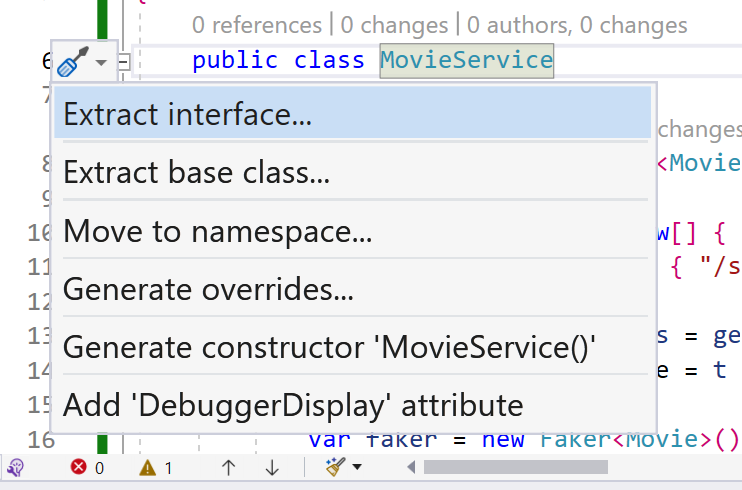
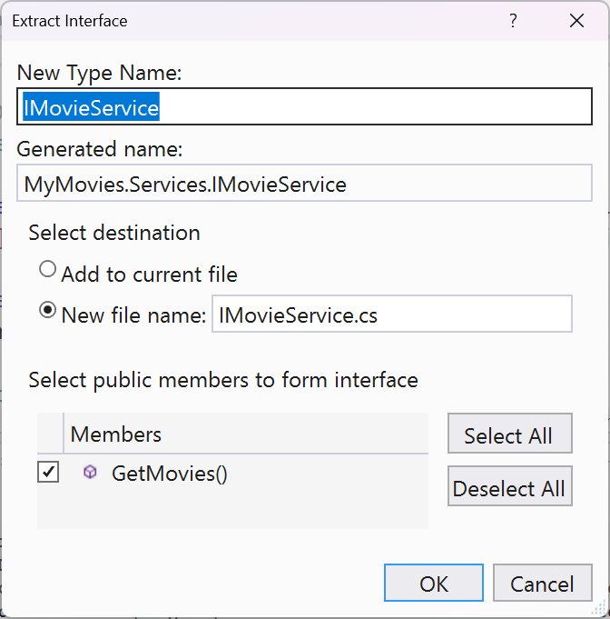

# Building a Movie Browser app with Blazor

In this lab, you will build a Blazor app that will list movie details. The app will be built using the [Blazor WebAssembly](https://docs.microsoft.com/aspnet/core/blazor/hosting-models#blazor-webassembly) hosting model. In this lab, you will be using fake movie data to populate the app. We'll hook it up to a real API later.

## Prerequisites

We'll be continuing from the code in the previous lab. If you haven't completed the previous lab, you can use the code in the [start](/Labs/4%20-%20Blazor/Start/) folder.

## Create a Blazor WebAssembly project

Visual Studio:
1. Open the **AmazingMovies.sln** file in Visual Studio.
1. Right-click on the **AmazingMovies** solution and select **Add** > **New Project**.
1. In the **Add a new project** dialog, select **Blazor App** and click **Next**.
1. In the **Configure your new project** dialog, set the following values:
    - **Project name**: **AmazingMovies.Client**
    - **Location**: (leave unchanged)
    - **Framework**: **.NET 7.0**
    - **Authentication**: **No Authentication**
    - **Configure for HTTPS**: **No**
    - **ASP.NET Core hosted**: **No**
    - **PWA**: **Yes**
    - **Do not use top-level statements**: **No**
1. Click **Create**.
1. Set the new application as the **Startup Project**.
1. Run the application.

Command Line:
1. Open a command prompt in the same directory as the **AmazingMovies.sln** file and run the following command:

    ```bash
    dotnet new blazorwasm -o AmazingMovies.Client --pwa -f net7.0
    cd .\AmazingMovies.Client\
    dotnet run
    ```

## Explore the project structure

The important files and folders in the project are:
- **wwwroot**: Contains static files that are served directly to clients.
- **Pages**: Contains Razor components that are used to render the UI.
- **Shared**: Contains Razor components that are shared across multiple pages.
- **Program.cs**: Contains the entry point for the application.
- **App.razor**: Contains the root component for the app.
- **wwwroot/index.html**: Contains the HTML markup for the app's entry point.

## Add a list of movies to the Index page

In this section, you will add a list of fake movies to the Index page using the **Bogus** library.

1. Add the **Bogus** NuGet package to the **AmazingMovies.Client** project.
1. Add a project reference to the **AmazingMovies.Models** project.
1. Open the **Pages/Index.razor** file.
1. Delete the following markup:

    ```html
    Welcome to your new app.

    <SurveyPrompt Title="How is Blazor working for you?" />
    ```
1. Add a using statement for the **AmazingMovies.Models** and **Bogus** namespaces just below the `@page` declaration:

    ```csharp
    @using Bogus
    @using AmazingMovies.Models
    ```
1. Add a **@code** block with an `IQueryable<Movie>` property just below the `<h1>` tag:

    ```csharp
    @code {
    private IQueryable<Movie>? movies;
    }
    ```
    > In a Blazor page, the **@code** block is used to add C# code to the page. The code in the **@code** block is executed when the page is rendered.

1. Add the following code to the botom of the **@code** block:

    ```csharp
    protected override async Task OnInitializedAsync()
    {
        string[] genreNames = new[] { "Action", "Adult", "Adventure", "Animation", "Biography", "Comedy", "Crime", "Documentary", "Drama", "Family", "Fantasy", "Film Noir", "Game Show", "History", "Horror", "Musical", "Music", "Mystery", "News", "Reality-TV", "Romance", "Sci-Fi", "Short", "Sport", "Talk-Show", "Thriller", "War", "Western" };
        string[] posters = new[] { "/s1VzVhXlqsevi8zeCMG9A16nEUf.jpg", "/cvsXj3I9Q2iyyIo95AecSd1tad7.jpg", "/t6HIqrRAclMCA60NsSmeqe9RmNV.jpg", "/3GrRgt6CiLIUXUtoktcv1g2iwT5.jpg", "/qNBAXBIQlnOThrVvA6mA2B5ggV6.jpg", "/ngl2FKBlU4fhbdsrtdom9LVLBXw.jpg", "/rzRb63TldOKdKydCvWJM8B6EkPM.jpg" };

        IEnumerable<Genre> genres = genreNames.Select(
            t => new Genre { Name = t });

        var faker = new Faker<Movie>()
            .RuleFor(m => m.Title, f => f.Random.Words(3))
            .RuleFor(m => m.Genre, f => f.PickRandom(genres))
            .RuleFor(m => m.ReleaseDate, f => f.Date.Past(50))
            .RuleFor(m => m.Poster, f => f.PickRandom(posters))
            .RuleFor(m => m.Plot, f => f.Rant.Review("movie"))
            .RuleFor(m => m.Price, f => f.Finance.Amount(5, 50));
        movies = faker.Generate(100).AsQueryable();
    }
    ```

The **OnInitializedAsync** method is called when the component is initialized. In this method, we are creating a list of fake movies using the **Bogus** library. Similar to the public properties in a **Razor Page**, we set the **movies** property so that we can bind to it in the markup.

## Testing our data with the QuickGrid

The **QuickGrid** is a handy component that can be used to quickly display data in a grid. It shipped separately in .NET 7, but will be officially included in .NET 8. We'll be using it to test our data.

1. Add a reference to the **Microsoft.AspNetCore.Components.QuickGrid** NuGet package, version **0.1.0-alpha.22351.1**.
    ```powershell
    dotnet add package Microsoft.AspNetCore.Components.QuickGrid --version 0.1.0-alpha.22351.1
    ```

1. Open the **Pages/Index.razor** file.
1. Add a using statement for the **Microsoft.AspNetCore.Components.QuickGrid** namespace:

    ```csharp
    @using Microsoft.AspNetCore.Components.QuickGrid
    ```
1. Add the following markup just below the `<h1>` tag:

    ```html
    <QuickGrid Items="@movies">
        <PropertyColumn Property="@(m => m.Title)" Sortable="true" />
        <PropertyColumn Property="@(m => m.Genre)" Sortable="true" />
        <PropertyColumn Property="@(m => m.ReleaseDate)" Format="yyyy-MM-dd" Sortable="true" />
    </QuickGrid>
    ```
1. Run the application. You should see a list of movies displayed in the grid.

## Add Plot and Poster to the Movie model

1. Open the **Movie.cs** file in the **AmazingMovies.Models** project.
1. Add the following properties:
    ```csharp
    public string? Poster { get; set; }
    public string? Plot { get; set; }
    ```
1. Create and run a migration in the **RazorPagesMovie** project. We're not going to be using it now, but it's a good practice to run migrations immediately after making changes to the model.

## Change the grid to use Bootstrap cards

The QuickGrid component was fine to quickly display some data, but it's not very pretty for displaying graphical information. Let's change the grid to use Bootstrap cards.

1. Delete the `<QuickGrid>` tag from the **Index.razor** file.
1. Above the `@code` block, add the following markup:
    ```html
    <div class="row row-cols-1 row-cols-md-4 g-4">
        @foreach (var item in movies)
        {
            <div class="col movie-card">
                <div class="card text-white bg-dark h-100">
                    <span class="lazy-load-image-background blur lazy-load-image-loaded" style="color: transparent; display: inline-block; height: 350px; width: 100%;">
                        
                    </span>
                    <div class="card-body">
                        <h5 class="card-title">@item.Title</h5>
                        <h6><span class="badge bg-secondary">@item.ReleaseDate.Year</span></h6>
                        <p class="card-text">
                            @item.Plot
                        </p>
                    </div>
                    <div class="card-footer mt-auto">
                        <a href="#" class="btn btn-outline-secondary">@item.Genre.Name</a>
                    </div>
                </div>
            </div>
        }
    </div>
    ```

This markup uses the Bootstrap grid to display the movies in a 4-column grid. Each movie is displayed in a [Bootstrap card](https://getbootstrap.com/docs/5.1/components/card/). The card displays the movie poster, title, release year, and plot. The genre is displayed as a badge. Feel free to explore the Bootstrap documentation and customize the card.

## Add scoped CSS to the Index page

Blazor includes support for scoped CSS. Scoped CSS is CSS that is only applied to the component that it is defined in. This is useful for defining styles that are specific to a component.

1. Add a new **Index.razor.css** file to the **Pages** folder. If using Visual Studio, you should see it nested below the **Index.razor** file.
1. Replace the code in **Index.razor.css** with the following:

    ```css
    .movie-card {
        transition: .3s transform cubic-bezier(.155,1.105,.295,1.12),.3s box-shadow,.3s -webkit-transform cubic-bezier(.155,1.105,.295,1.12);
    }

        .movie-card:hover {
            transform: scale(1.05);
            box-shadow: 0 10px 20px rgba(0,0,0,.12), 0 4px 8px rgba(0,0,0,.06);
        }
    ```
1. Run the application. You should see a hover effect for the movie cards.

## Implement dark theme support

Bootstrap 5.3 includes support for [color modes](https://getbootstrap.com/docs/5.3/customize/color/#color-modes). Color modes allow you to define a light and dark theme for your application. We'll use this to implement a dark theme for our application. First, we'll need to update from Bootstrap 5.1 to 5.3.

### Update to Bootstrap 5.3

1. Open the **wwwroot/index.html** file.
1. Find the line which reads:
    
    ```html
    <link href="css/bootstrap/bootstrap.min.css" rel="stylesheet" />
    ```
1. Replace it with the following:
    
    ```html
    <link href="https://cdn.jsdelivr.net/npm/bootstrap@5.3.0-alpha3/dist/css/bootstrap.min.css" rel="stylesheet" integrity="sha384-KK94CHFLLe+nY2dmCWGMq91rCGa5gtU4mk92HdvYe+M/SXH301p5ILy+dN9+nJOZ" crossorigin="anonymous">
    ```

    >This is the CDN link for Bootstrap 5.3. We're using the CDN link instead of the local copy of Bootstrap so that we can easily update to a newer version of Bootstrap in the future. However, if you prefer, you can [download the Bootstrap 5.3 CSS file (bootstrap.min.css)](https://getbootstrap.com/docs/5.3/getting-started/download/) and add it to the **wwwroot/css/bootstrap** folder.

1. In the same file, update the `<html>` tag to include the `data-bs-theme` attribute:
    
    ```html
    <html lang="en" data-bs-theme="dark">
    ```

1. Run the application and verify that the theme is now dark.

Let's do a little miscellaneous cleanup in the layout so the site looks better with the new theme. 

1. Open the **Shared/MainLayout.razor** file.
1. Delete the `<div class="top-row px-4">` element.
1. Delete the `<div class="sidebar">` element. This will remove the navigation menu from the site; if we want to add it back later, we can do so easily.
1. Open the **Pages/Index.razor** file.
1. Update the `<h1>` element to say something more exciting, maybe:
        
    ```html
    <h1>🎬Amazing Movies. The best site ever made.🎬</h1>
    ``` 

## (Optional) Move the fake movie generation to a service

The **OnInitializedAsync** method is getting kind of cluttered, and we're planning to replace the fake movie generation with an API call later, so let's move the fake movie generation to a service.

### Create the MovieService class

1. Add a new **Services** folder to the **AmazingMovies.Client** project.
1. Add a new class to the **Services** folder named **MovieService.cs**.
1. Add the following code to the **MovieService.cs** file:

    ```csharp
    using AmazingMovies.Models;
    using Bogus;

    namespace MyMovies.Services
    {
        public class MovieService
        {
            public async Task<IQueryable<Movie>> GetMovies()
            {
                string[] genreNames = new[] { "Action", "Adult", "Adventure", "Animation", "Biography", "Comedy", "Crime", "Documentary", "Drama", "Family", "Fantasy", "Film Noir", "Game Show", "History", "Horror", "Musical", "Music", "Mystery", "News", "Reality-TV", "Romance", "Sci-Fi", "Short", "Sport", "Talk-Show", "Thriller", "War", "Western" };
                string[] posters = new[] { "/s1VzVhXlqsevi8zeCMG9A16nEUf.jpg", "/cvsXj3I9Q2iyyIo95AecSd1tad7.jpg", "/t6HIqrRAclMCA60NsSmeqe9RmNV.jpg", "/3GrRgt6CiLIUXUtoktcv1g2iwT5.jpg", "/qNBAXBIQlnOThrVvA6mA2B5ggV6.jpg", "/ngl2FKBlU4fhbdsrtdom9LVLBXw.jpg", "/rzRb63TldOKdKydCvWJM8B6EkPM.jpg" };

                IEnumerable<Genre> genres = genreNames.Select(
                    t => new Genre { Name = t });

                var faker = new Faker<Movie>()
                    .RuleFor(m => m.Title, f => f.Random.Words(3))
                    .RuleFor(m => m.Genre, f => f.PickRandom(genres))
                    .RuleFor(m => m.ReleaseDate, f => f.Date.Past(50))
                    .RuleFor(m => m.Poster, f => f.PickRandom(posters))
                    .RuleFor(m => m.Plot, f => f.Rant.Review("movie"))
                    .RuleFor(m => m.Price, f => f.Finance.Amount(5, 50));
                return faker.Generate(100).AsQueryable();
            }
        }
    }
    ```
    > This code is the same as the code in the **OnInitializedAsync** method, except that we've added in poster and plot data. We're also returning a list of movies instead of setting the **movies** property.

### Extract the IMovieService interface

We need to create an `IMovieService` interface so that we can inject the service into our component. 

If using Visual Studio, you can use the **Extract Interface** refactoring to create the interface.




Otherwise, you can create the interface manually.
1. Create a new **IMovieService.cs** file in the **Services** folder with the following code:
    
        ```csharp
        using AmazingMovies.Models;

        namespace MyMovies.Services
        {
            public interface IMovieService
            {
                Task<IQueryable<Movie>> GetMovies();
            }
        }        
        ```
1. Update the **MovieService** class to implement the **IMovieService** interface:

    ```csharp
    public class MovieService : IMovieService
    ```
1. Register the **MovieService** class as a singleton in the **Program.cs** file, just before the final line:

    ```csharp
    builder.Services.AddSingleton<IMovieService, MovieService>();
    ```

### Inject the MovieService into the Index component

Now that we've configured a service, we can inject it into our component and use it in the **OnInitializedAsync** method.

1. Open the **Index.razor** file.
1. Add the following using statement:

    ```csharp
    @using MyMovies.Services
    ```
1. Add the following code to the top of the **Index** component:

    ```csharp
    @inject IMovieService MovieService
    ```
1. Replace the code in the **OnInitializedAsync** method with the following:

    ```csharp
    movies = await MovieService.GetMovies();
    ```
1. Run the application. You should see the same list of movies displayed in the grid.